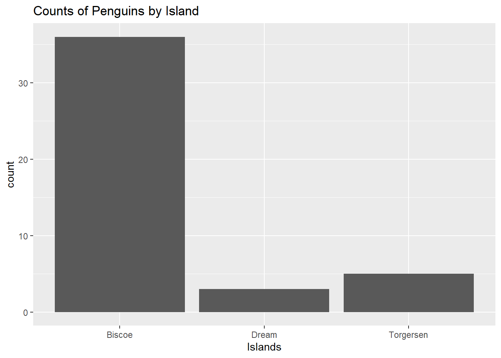
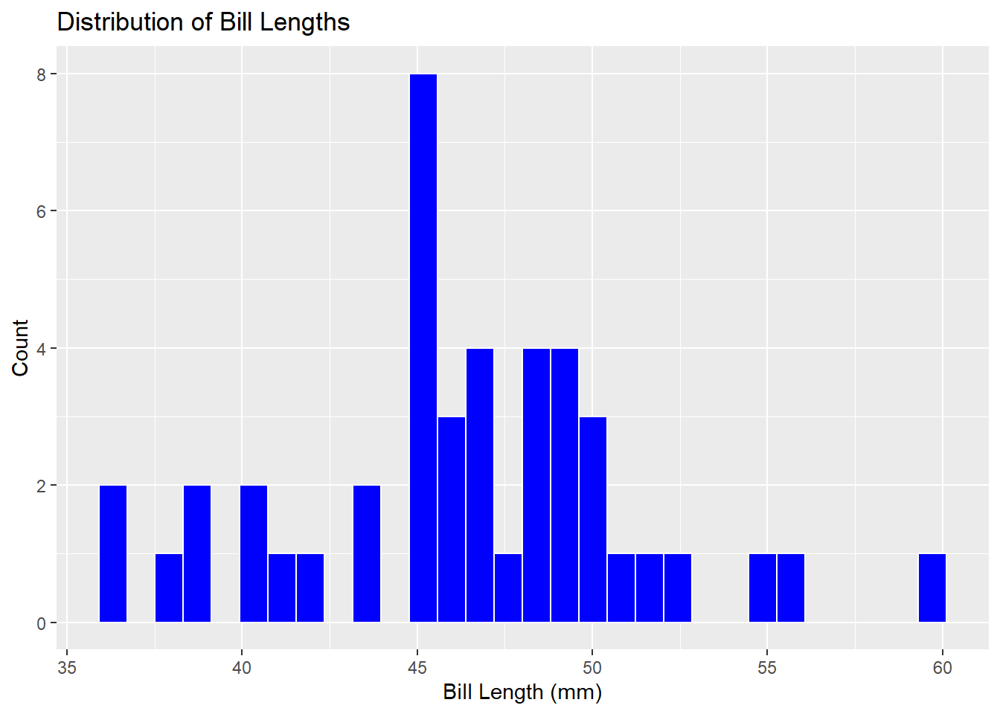
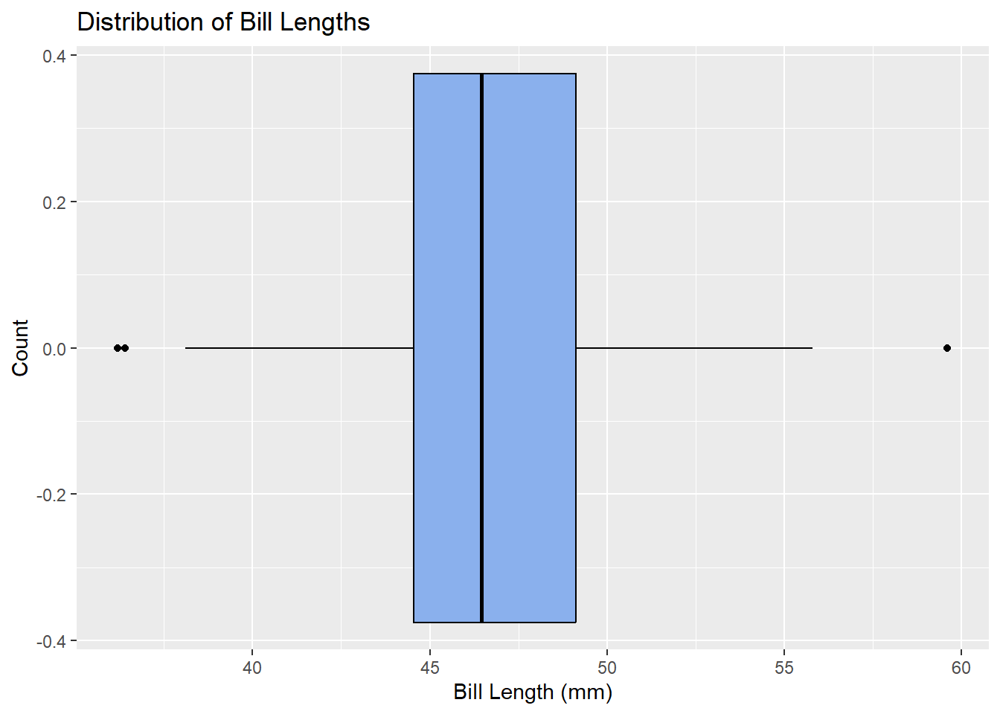
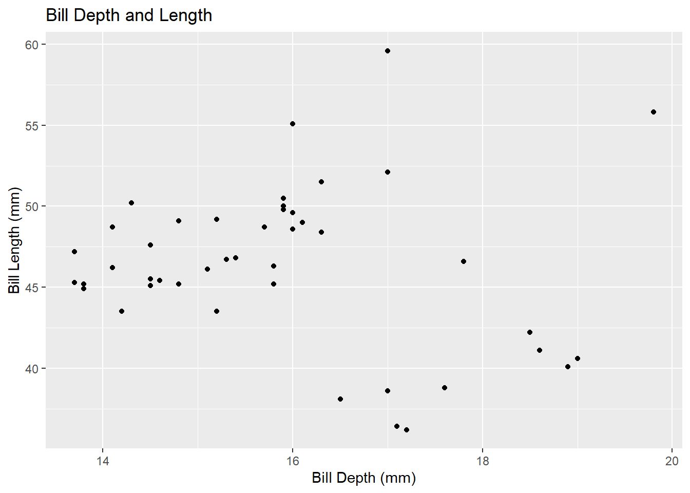
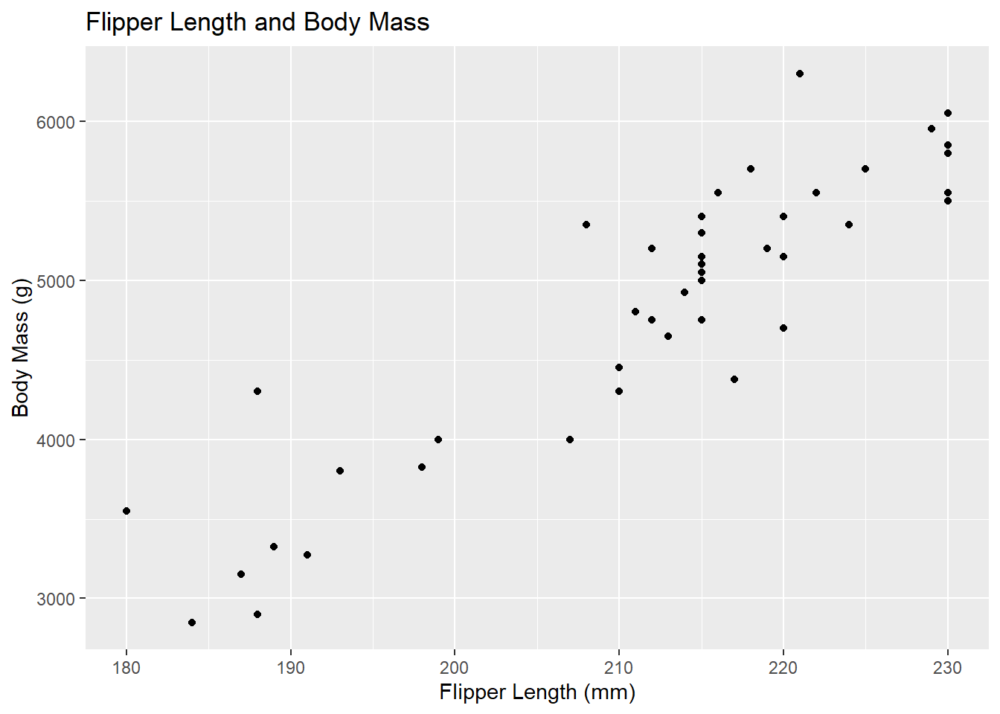
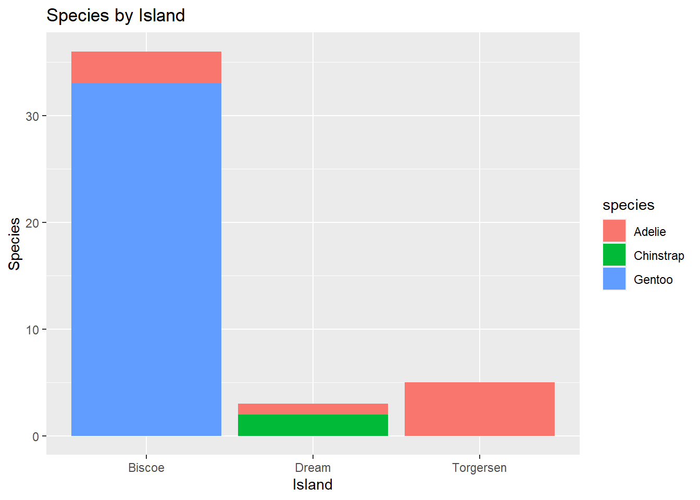
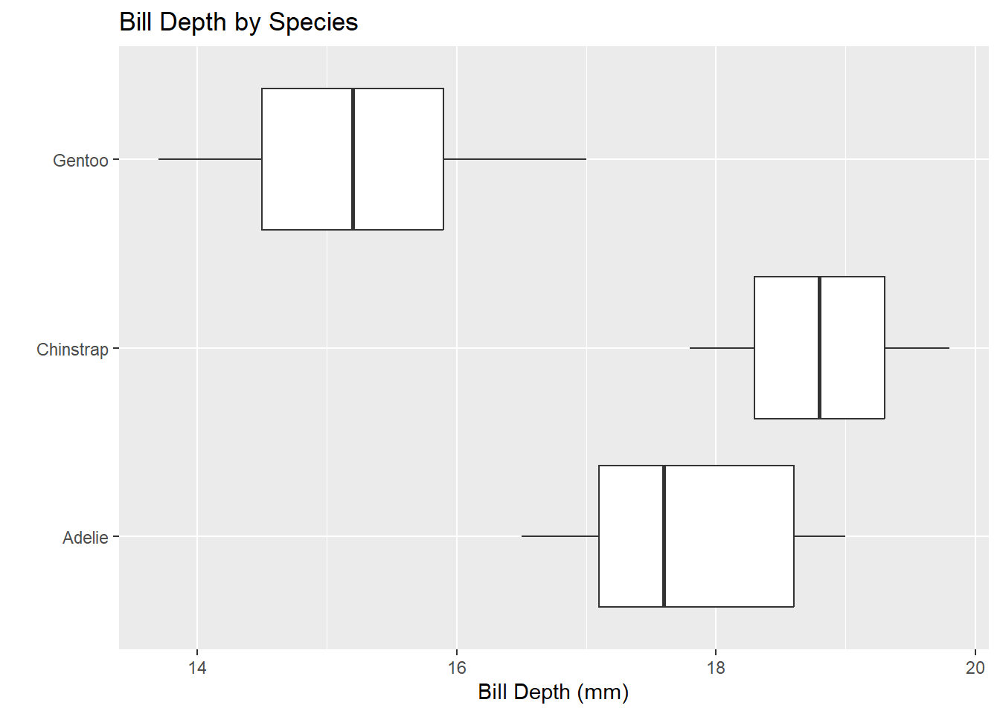
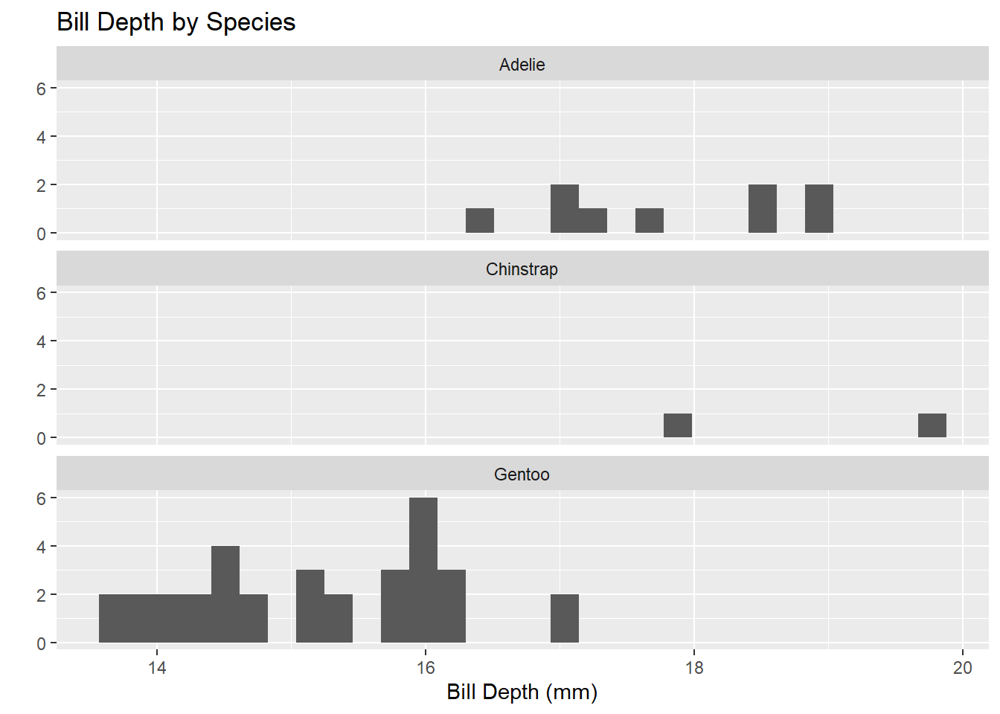
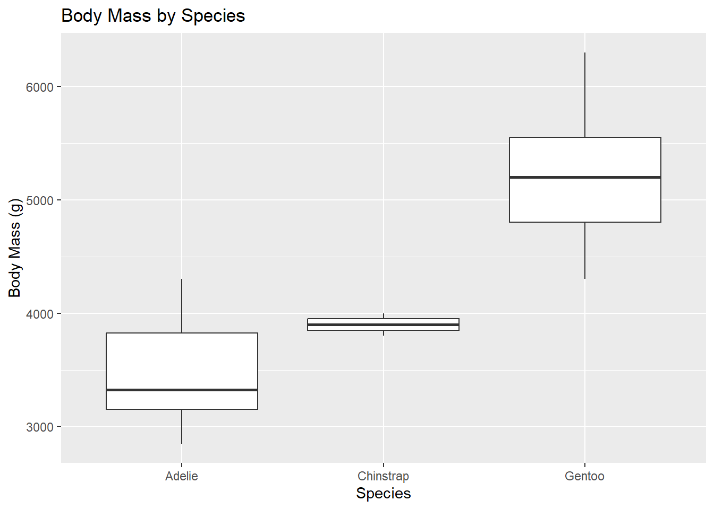

# Palmer Penguins

(*Insert informative blurb here*)


::: {.cell}

```{.r .cell-code}
library(tidyverse)

penguins <- read_csv("https://raw.githubusercontent.com/mcduryea/Intro-to-Bioinformatics/main/data/penguins_samp1.csv")

penguins |> head()
```

::: {.cell-output .cell-output-stdout}
```
# A tibble: 6 × 8
  species island bill_length_mm bill_depth_mm flipper_length_mm body_mass_g
  <chr>   <chr>           <dbl>         <dbl>             <dbl>       <dbl>
1 Gentoo  Biscoe           59.6          17                 230        6050
2 Gentoo  Biscoe           48.6          16                 230        5800
3 Gentoo  Biscoe           52.1          17                 230        5550
4 Gentoo  Biscoe           51.5          16.3               230        5500
5 Gentoo  Biscoe           55.1          16                 230        5850
6 Gentoo  Biscoe           49.8          15.9               229        5950
# ℹ 2 more variables: sex <chr>, year <dbl>
```
:::
:::


After loading our packages and data, we can use the `head` function to take a peek at the first few rows of our data set.

## Displaying Data


::: {.cell}

```{.r .cell-code}
penguins |>
  count(island)
```

::: {.cell-output .cell-output-stdout}
```
# A tibble: 3 × 2
  island        n
  <chr>     <int>
1 Biscoe       36
2 Dream         3
3 Torgersen     5
```
:::
:::


This simple command allows us to sort our data by count. In this case, R can count how many instances are in each category. Here we can see there are `36` penguins from Biscoe Island, `3` penguins from Dream Island, and `5` penguins from Torgersen Island.


::: {.cell}

```{.r .cell-code}
penguins |>
  count(island, species)
```

::: {.cell-output .cell-output-stdout}
```
# A tibble: 5 × 3
  island    species       n
  <chr>     <chr>     <int>
1 Biscoe    Adelie        3
2 Biscoe    Gentoo       33
3 Dream     Adelie        1
4 Dream     Chinstrap     2
5 Torgersen Adelie        5
```
:::

```{.r .cell-code}
#Dr. D's example
penguins %>%
  count(island, species) %>%
  pivot_wider(names_from = species, values_from = n, values_fill = 0)
```

::: {.cell-output .cell-output-stdout}
```
# A tibble: 3 × 4
  island    Adelie Gentoo Chinstrap
  <chr>      <int>  <int>     <int>
1 Biscoe         3     33         0
2 Dream          1      0         2
3 Torgersen      5      0         0
```
:::
:::


By using the parameters of both island and species within `count`, we can see how many penguins of each species were found on the islands. The first line shows a simple way of executing the function that creates multiple instances of each island when there is a different species. The second command is Dr. Duryea's example for making a "prettier" version of the table, with separate columns for each species for better legibility.


::: {.cell}

```{.r .cell-code}
library(kableExtra)

#another example from Dr. D
penguins %>%
  count(island, species) %>%
  pivot_wider(names_from = species, values_from = n, values_fill = 0) %>%
  kable() %>%
  kable_styling(bootstrap_options = c("hover", "striped"))
```

::: {.cell-output-display}

`````{=html}
<table class="table table-hover table-striped" style="margin-left: auto; margin-right: auto;">
 <thead>
  <tr>
   <th style="text-align:left;"> island </th>
   <th style="text-align:right;"> Adelie </th>
   <th style="text-align:right;"> Gentoo </th>
   <th style="text-align:right;"> Chinstrap </th>
  </tr>
 </thead>
<tbody>
  <tr>
   <td style="text-align:left;"> Biscoe </td>
   <td style="text-align:right;"> 3 </td>
   <td style="text-align:right;"> 33 </td>
   <td style="text-align:right;"> 0 </td>
  </tr>
  <tr>
   <td style="text-align:left;"> Dream </td>
   <td style="text-align:right;"> 1 </td>
   <td style="text-align:right;"> 0 </td>
   <td style="text-align:right;"> 2 </td>
  </tr>
  <tr>
   <td style="text-align:left;"> Torgersen </td>
   <td style="text-align:right;"> 5 </td>
   <td style="text-align:right;"> 0 </td>
   <td style="text-align:right;"> 0 </td>
  </tr>
</tbody>
</table>

`````

:::
:::


An even prettier way to create a readable table is to utilize the `kableExtra` package. This creates a more table-like display with the same columns as the last example and some extra styling.

## Numerical Summaries


::: {.cell}

```{.r .cell-code}
penguins %>%
  summarize(mean_bill_length_mm = mean(bill_length_mm))
```

::: {.cell-output .cell-output-stdout}
```
# A tibble: 1 × 1
  mean_bill_length_mm
                <dbl>
1                46.4
```
:::

```{.r .cell-code}
penguins %>%
  summarize(mean_bill_length_mm = mean(bill_length_mm, na.rm = TRUE))
```

::: {.cell-output .cell-output-stdout}
```
# A tibble: 1 × 1
  mean_bill_length_mm
                <dbl>
1                46.4
```
:::
:::


Here, we can summarize one of our numerical values with `summarize()`. If there are values missing from the data, then R won't calculate the solution to your computation, and the result will be NA. To avoid this, we add `na.rm = TRUE` as a parameter.


::: {.cell}

```{.r .cell-code}
penguins %>%
  summarize(
    min_bill_length = min(bill_length_mm, na.rm = TRUE),
    first_quartile_bill_length = quantile(bill_length_mm, 0.25, na.rm = TRUE),
    median_bill_length = median(bill_length_mm, na.rm = TRUE),
    mean_bill_length_mm = mean(bill_length_mm, na.rm = TRUE),
    third_quartile_bill_length = quantile(bill_length_mm, 0.75, na.rm = TRUE),
    standard_deviation_bill_length = sd(bill_length_mm, na.rm = TRUE)
    ) %>%
  pivot_longer(cols = everything())
```

::: {.cell-output .cell-output-stdout}
```
# A tibble: 6 × 2
  name                           value
  <chr>                          <dbl>
1 min_bill_length                36.2 
2 first_quartile_bill_length     44.6 
3 median_bill_length             46.4 
4 mean_bill_length_mm            46.4 
5 third_quartile_bill_length     49.1 
6 standard_deviation_bill_length  4.93
```
:::
:::


For more information, we can also find other statistics, like the minimum, maximum, mean, and more from our data. In each of them, we can include `na.rm = TRUE` to make sure R is returning a number and not `NA`.


::: {.cell}

```{.r .cell-code}
penguins %>%
  filter(!is.na(bill_length_mm)) |>
  summarize(
    min_bill_length = min(bill_length_mm),
    first_quartile_bill_length = quantile(bill_length_mm, 0.25),
    median_bill_length = median(bill_length_mm),
    mean_bill_length_mm = mean(bill_length_mm),
    third_quartile_bill_length = quantile(bill_length_mm, 0.75),
    standard_deviation_bill_length = sd(bill_length_mm)
    ) %>%
  pivot_longer(cols = everything())
```

::: {.cell-output .cell-output-stdout}
```
# A tibble: 6 × 2
  name                           value
  <chr>                          <dbl>
1 min_bill_length                36.2 
2 first_quartile_bill_length     44.6 
3 median_bill_length             46.4 
4 mean_bill_length_mm            46.4 
5 third_quartile_bill_length     49.1 
6 standard_deviation_bill_length  4.93
```
:::
:::


An easier way to remove all the missing values while running this analysis is to use a filter before summarizing. By using `!is.na`, we tell the function to include every value that isn't `NA`.


::: {.cell}

```{.r .cell-code}
penguins %>%
  filter(!is.na(bill_length_mm)) |>
  summarize(
    min_bill_length = min(bill_length_mm),
    first_quartile_bill_length = quantile(bill_length_mm, 0.25),
    median_bill_length = median(bill_length_mm),
    mean_bill_length_mm = mean(bill_length_mm),
    third_quartile_bill_length = quantile(bill_length_mm, 0.75),
    standard_deviation_bill_length = sd(bill_length_mm)
    ) %>%
  pivot_longer(cols = everything()) |>
  kable() %>%
  kable_styling(bootstrap_options = c("hover", "striped"))
```

::: {.cell-output-display}

`````{=html}
<table class="table table-hover table-striped" style="margin-left: auto; margin-right: auto;">
 <thead>
  <tr>
   <th style="text-align:left;"> name </th>
   <th style="text-align:right;"> value </th>
  </tr>
 </thead>
<tbody>
  <tr>
   <td style="text-align:left;"> min_bill_length </td>
   <td style="text-align:right;"> 36.200000 </td>
  </tr>
  <tr>
   <td style="text-align:left;"> first_quartile_bill_length </td>
   <td style="text-align:right;"> 44.550000 </td>
  </tr>
  <tr>
   <td style="text-align:left;"> median_bill_length </td>
   <td style="text-align:right;"> 46.450000 </td>
  </tr>
  <tr>
   <td style="text-align:left;"> mean_bill_length_mm </td>
   <td style="text-align:right;"> 46.370455 </td>
  </tr>
  <tr>
   <td style="text-align:left;"> third_quartile_bill_length </td>
   <td style="text-align:right;"> 49.125000 </td>
  </tr>
  <tr>
   <td style="text-align:left;"> standard_deviation_bill_length </td>
   <td style="text-align:right;"> 4.930379 </td>
  </tr>
</tbody>
</table>

`````

:::
:::


Now that everything is sorted, we can pipe our work into a kable command like before to make an appealing table.

## Selecting Columns and Rows


::: {.cell}

```{.r .cell-code}
penguins |>
  select(species, island, sex, year)
```

::: {.cell-output .cell-output-stdout}
```
# A tibble: 44 × 4
   species island sex    year
   <chr>   <chr>  <chr> <dbl>
 1 Gentoo  Biscoe male   2007
 2 Gentoo  Biscoe male   2008
 3 Gentoo  Biscoe male   2009
 4 Gentoo  Biscoe male   2009
 5 Gentoo  Biscoe male   2009
 6 Gentoo  Biscoe male   2009
 7 Gentoo  Biscoe male   2008
 8 Gentoo  Biscoe male   2009
 9 Gentoo  Biscoe male   2008
10 Gentoo  Biscoe male   2007
# ℹ 34 more rows
```
:::
:::


Here, we can use the `select()` function to isolate only the columns we're focused on for all of our instances.


::: {.cell}

```{.r .cell-code}
penguins |>
  select(species, island, sex, year) |>
  filter(species == "Chinstrap")
```

::: {.cell-output .cell-output-stdout}
```
# A tibble: 2 × 4
  species   island sex     year
  <chr>     <chr>  <chr>  <dbl>
1 Chinstrap Dream  male    2009
2 Chinstrap Dream  female  2007
```
:::
:::


By piping the result into a filter function, we can see only the species we are interested in, like Chinstrap penguins in this example.


::: {.cell}

```{.r .cell-code}
chinstraps <- penguins |>
  select(species, island, sex, year) |>
  filter(species == "Chinstrap") |>
  select(-species)

chinstraps |>
  head()
```

::: {.cell-output .cell-output-stdout}
```
# A tibble: 2 × 3
  island sex     year
  <chr>  <chr>  <dbl>
1 Dream  male    2009
2 Dream  female  2007
```
:::
:::


Since we're only working with one species, we can deselect it from our output with `select(-species)` then using another `head()` function to display our results.

## Grouping


::: {.cell}

```{.r .cell-code}
penguins %>%
  group_by(species) %>%
  summarise(
    mean_bill_depth_mm = mean(bill_depth_mm, na.rm = TRUE),
    sd_bill_depth_mm = sd(bill_depth_mm, na.rm = TRUE)
  )
```

::: {.cell-output .cell-output-stdout}
```
# A tibble: 3 × 3
  species   mean_bill_depth_mm sd_bill_depth_mm
  <chr>                  <dbl>            <dbl>
1 Adelie                  17.8            0.935
2 Chinstrap               18.8            1.41 
3 Gentoo                  15.2            0.951
```
:::
:::


The function `group_by()` allows us to group our data by the species of penguin and subsequently use them to find the mean bill length and depth of each species independently.

Based on that computation, Chinstrap penguins had the largest mean depth compared to the other species but also the largest standard deviation, meaning the given values varied from the mean more widely than the other species. Adelie penguins had the next largest mean bill depth, and Gentoo penguins had the smallest mean bill depth. Both Adelie and Gentoo penguins had similar deviations compared to the Chinstraps.

## Data Visualization

### One Categorical Variable

::: {.cell}

```{.r .cell-code}
penguins %>%
  ggplot() +
  geom_bar(mapping = aes(x = species)) +
  labs(title ="Counts of Penguin Species",
       x = "Species", y = "Count")
```

::: {.cell-output-display}
{width=672}
:::
:::


This plot from Dr. D's examples illustrates the total count of each species of penguin within the data frame. We can see that Gentoo penguins were the most common within the data set, followed by Adelie and then Chinstraps. 


::: {.cell}

```{.r .cell-code}
penguins |>
  ggplot() +
  geom_bar(mapping = aes(x = island)) +
  labs(
    title = "Counts of Penguins by Island",
    x = "Islands"
  )
```

::: {.cell-output-display}
{width=672}
:::
:::


I created this plot to display the count of penguins in the data frame based on which island they were from. Most penguins were from Biscoe Island. Torgersen Island had far less penguins but had the second most penguins, and Dream Island had the least amount of penguins.

### One Numerical Variable


::: {.cell}

```{.r .cell-code}
penguins %>%
  ggplot() +
  geom_histogram(mapping = aes(x = bill_length_mm),
                 color = "white",
                 fill = "blue"
                 ) +
  labs(title ="Distribution of Bill Lengths",
       x = "Bill Length (mm)", y = "Count")
```

::: {.cell-output .cell-output-stderr}
```
`stat_bin()` using `bins = 30`. Pick better value with `binwidth`.
```
:::

::: {.cell-output-display}
{width=672}
:::
:::


Dr. D's example histogram has the data summarized by bill length. We can observe that the tallest peaks, meaning highest count of penguins, lie between around 45 and 50 mm. 


::: {.cell}

```{.r .cell-code}
penguins |>
  ggplot() +
  geom_boxplot(
    mapping = aes(x = bill_length_mm), 
    color = "black",
    fill = "#8ab0ed"
  ) +
  labs(
    title = "Distribution of Bill Lengths",
    x = "Bill Length (mm)", y = "Count"
  )
```

::: {.cell-output-display}
{width=672}
:::
:::


This box plot uses the same data but differentiates the percentiles of the data. Half of all the penguin bill lengths fall between the two sides of the box, with the lower 25% of values extending out from the box on the left, and the upper 25% on the right. The dark line at the center represents the median. While the histogram can give you a good idea of the most common value(s) for a variable at a quick glance, you can use a box plot to more easily visualize different statistics that you might be interested in depending on the data you're looking at and what you're using it for. 

### Two Numerical Variables


::: {.cell}

```{.r .cell-code}
penguins %>%
  ggplot() +
  geom_point(mapping = aes(x = bill_depth_mm, y = bill_length_mm)) +
  labs(title = "Bill Depth and Length",
       x = "Bill Depth (mm)",
       y = "Bill Length (mm)")
```

::: {.cell-output-display}
{width=672}
:::
:::

With two numerical variables, a scatter plot is the most common method of displaying the data. This one compares the bill length of each penguin to the bill depth, both measured in millimeters. You can observe a slight positive correlation at the first half of the scatterplot that becomes more chaotic as bill depth increases.


::: {.cell}

```{.r .cell-code}
penguins |>
  ggplot() +
  geom_point(mapping = aes(x = flipper_length_mm, y = body_mass_g)) +
  labs(title = "Flipper Length and Body Mass",
       x = "Flipper Length (mm)",
       y = "Body Mass (g)")
```

::: {.cell-output-display}
{width=672}
:::
:::


My scatterplot is a visualization of flipper length compared to body mass. Compared to the previous plot, there seems to be a much stronger positive correlation between the two variables. 

### Two Categorical Variables


::: {.cell}

```{.r .cell-code}
penguins %>%
  ggplot() +
  geom_bar(mapping = aes(x = island, fill = species)) +
  labs(title = "Species by Island",
       x = "Island",
       y = "Species")
```

::: {.cell-output-display}
{width=672}
:::
:::


With two categorical variables, we use a variation of bar graphs that adds coloration to differentiate the second variable. In this graph, we see again that Biscoe Island had the most penguin observations out of the three, but now we also know most of those instances were Gentoo penguins followed by a few Adelie penguins. Dream Island had both Adelie and Chinstrap penguins, and it was the only island to have Chinstraps. Lastly, Torgersen Island only had observations of Adelie penguins and no other species.

### Categorical and Numerical Variables


::: {.cell}

```{.r .cell-code}
penguins %>%
  ggplot() +
  geom_boxplot(mapping = aes(x = bill_depth_mm, y = species)) +
  labs(title = "Bill Depth by Species",
       x = "Bill Depth (mm)",
       y = "")
```

::: {.cell-output-display}
{width=672}
:::
:::

::: {.cell}

```{.r .cell-code}
penguins %>%
  ggplot() +
  geom_histogram(mapping = aes(x = bill_depth_mm)) +
  facet_wrap(~species, ncol = 1) +
  labs(title = "Bill Depth by Species",
       x = "Bill Depth (mm)",
       y = "")
```

::: {.cell-output .cell-output-stderr}
```
`stat_bin()` using `bins = 30`. Pick better value with `binwidth`.
```
:::

::: {.cell-output-display}
{width=672}
:::
:::

::: {.cell}

```{.r .cell-code}
penguins |>
  ggplot() +
  geom_boxplot(
    mapping = aes(
      x = species, 
      y = body_mass_g)
    ) +
  labs(
    title = "Body Mass by Species",
    x = "Species", y = "Body Mass (g)"
  )
```

::: {.cell-output-display}
{width=672}
:::
:::


This graph I created displays the different 
